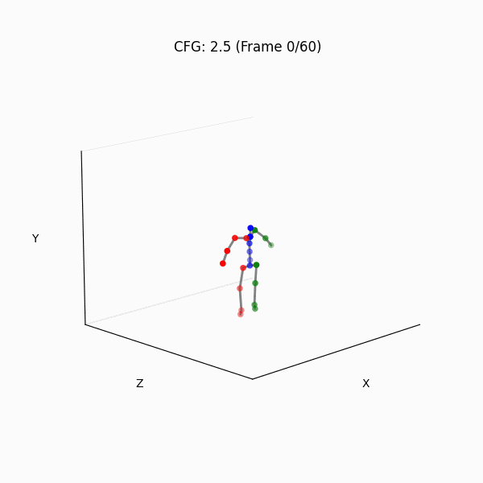

# Motion-Diffusion-From-Scratch

A lightweight, educational PyTorch implementation of a Transformer-based Motion Diffusion Model (MDM). 

Instead of relying on massive, computationally expensive Motion Capture (MoCap) datasets, this project builds a complete generative diffusion pipeline using a custom **procedural synthetic motion engine**. This allows the entire model to be trained and evaluated quickly on a single GPU (or CPU) while still demonstrating state-of-the-art diffusion mechanics.

##  Key Features

* **Synthetic Motion Engine:** Procedurally generates 3D skeletal animations (Walk, Run, Jump, Wave, Sit) using kinematic math, providing infinite, perfectly clean training data.
* **Transformer Architecture:** Implements a modern Pre-Norm Transformer Encoder with Sinusoidal Positional Encodings and SiLU-activated Timestep Embeddings.
* **Gaussian Diffusion (DDPM):** Features a cosine noise schedule and implements the reverse diffusion process predicting the clean sample ($x_0$) directly.
* **Classifier-Free Guidance (CFG):** Includes dynamic CFG scaling to enforce strict adherence to action prompts while preventing late-stage noise artifacts.
* **Geometric Physics Losses:** Prevents unnatural movement by implementing custom loss functions for:
    * *Velocity:* Ensuring smooth frame-to-frame transitions.
    * *Foot Contact:* Heavily penalizing "foot skating" by enforcing zero-velocity when feet are planted.
* **Motion Inpainting:** Uses the RePaint method to seamlessly generate missing "in-between" frames given a starting and ending pose.

##  Why Predict $x_0$ instead of $\epsilon$?
Standard image diffusion models predict the noise ($\epsilon$). However, human motion requires strict physical constraints (like bone length and foot contact). Calculating these physical losses on a noisy tensor is mathematically unstable. By configuring this model to predict the clean motion ($x_0$) directly at every timestep, we can apply robust geometric losses directly to the model's output, resulting in significantly higher-quality animations.

##  Usage & Architecture

The entire pipeline is contained within a heavily documented Jupyter Notebook. It is broken down into modular tasks:
1.  **Skeleton Definition:** Defining the 22-joint kinematic tree and T-pose constraints.
2.  **Synthetic Dataset:** Generating the math-based training data and calculating ground-truth foot contacts.
3.  **Model Building:** Assembling the Attention blocks, MLPs, and embedding layers.
4.  **Diffusion Math:** Implementing the `q_sample` (forward) and `q_posterior` (reverse) equations.
5.  **Training Loop:** A standard PyTorch training loop using AdamW, gradient clipping, and Cosine Annealing.
6.  **Inference:** DDPM sampling loops to generate `.gif` visualizations of the model's hallucinations.

##  Getting Started

### Prerequisites
* Python 3.8+
* PyTorch
* NumPy
* Matplotlib
* Imageio (for GIF generation)
* tqdm (for progress bars)

### Running the Notebook
Simply clone the repository, install the dependencies, and run all cells in the Jupyter Notebook. The notebook will automatically:
1. Generate 1,000 synthetic animations.
2. Train the Transformer model for 15 epochs.
3. Output a training loss curve.
4. Generate and save `.gif` files of the AI's learned animations to your local directory.

##  Acknowledgments
This project's architecture and mathematical approach are heavily inspired by the original paper: [Human Motion Diffusion Model (Tevet et al., 2022)](https://arxiv.org/abs/2209.14916).
